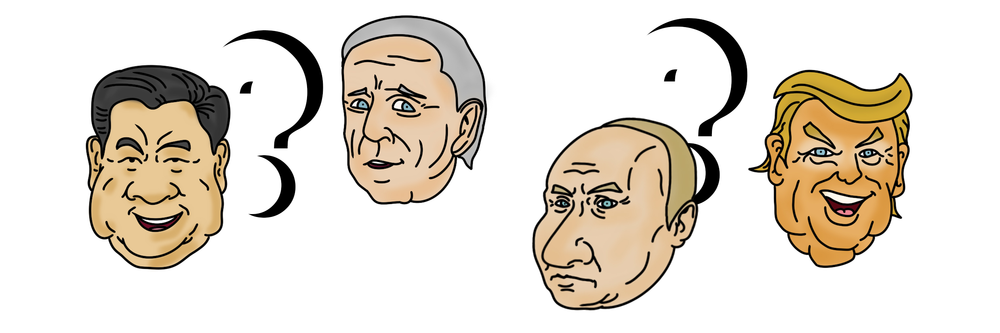

# Activos

Hay dos tipos de NFT:

1. P. NFT (presidentes)

* Solo están disponibles con Matic
* Hay 2 niveles de P. NFTs

2\. U. NFT (utilidad)

* Solo están disponibles con UP o en el mercado (Matic y UP)
* También hay 2 Niveles de U. NFT

3\) L. NFT (legendarios)

* Solo están disponibles con UP o en el mercado (Matic y UP)

4 ) El token TSK es nuestro token ERC20 del juego

* &#x20;Impuestos incluidos

