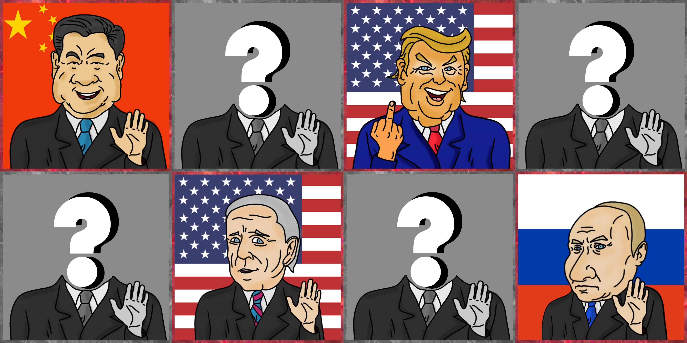

# P. NFT

### Minting

* Mediados de marzo primeros 80 P. NFT de los 4 primeros presidentes (320 jugadores)
* A mediados de marzo los primeros 80 P. NFT de los últimos 6 presidentes (480 jugadores)
* El 7 de abril, los usuarios podrán acuñar 1 P. NFT de cada tipo cada 6 horas (para todos los usuarios)

**Entre mayo y junio** se venderán todos los NFT y **alcanzaremos el máximo de 2000 jugadores**

<table><thead><tr><th>Level</th><th>Each NFT</th><th>President</th><th align="right">RP</th><th data-type="checkbox" data-hidden></th><th data-hidden></th></tr></thead><tbody><tr><td>ONE</td><td> 15$ in Matic</td><td>45$ in Matic</td><td align="right">x 1</td><td>false</td><td></td></tr><tr><td>TWO</td><td> 45$ in Matic </td><td>135$ in Matic</td><td align="right">x 3</td><td>false</td><td></td></tr></tbody></table>

### Atributos

* Cobardía &#x20;
* Diplomacia&#x20;
* Ferocidad&#x20;
* Infractor de la ley
* Intensidad de niño tonto

