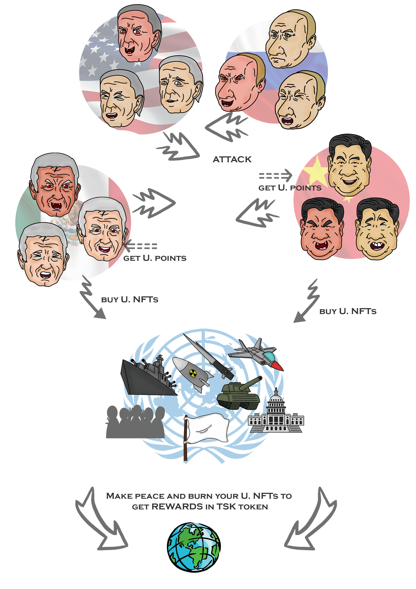

# Gameplay

1\) Elige al menos un presidente (Necesitarás tres expresiones para obtener recompensas)&#x20;

2\) Realiza "ataques" diarios y obtén Puntos de Utilidad (UP)&#x20;

3\) Acumula NFTs de utilidad (U. NFT) quemando UP&#x20;

4\) "Compra o vende" los U.NFT que necesites o te sobren&#x20;

5\) "Haz la paz" quemando todos tus UP y U. NFT y obtén Puntos de Recompensa (RP)&#x20;

6\) Cambia tus RP para conseguir una ficha TSK&#x20;

PD: Podrás empezar a obtener RP tan pronto como se revelen los P. NFT (20-24 de marzo)

